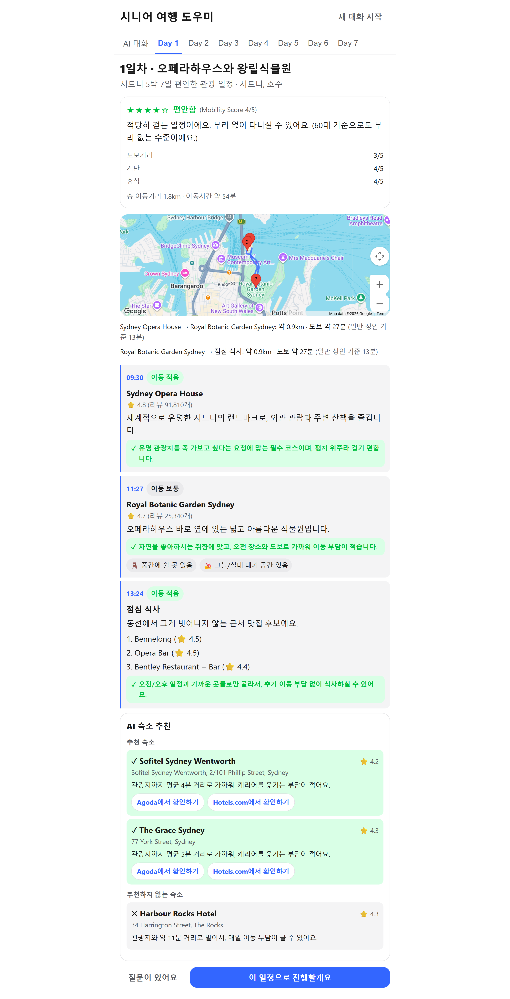
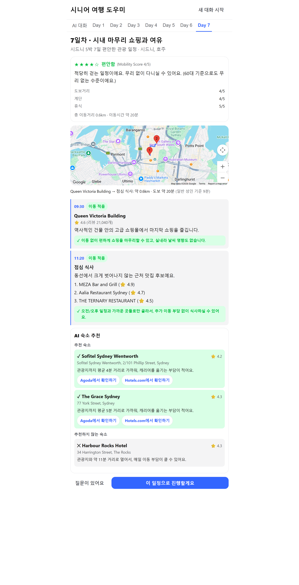

# 시니어 여행 도우미 (Senior Travel AI)

시니어(고령층) 여행자를 위한 대화형 여행 계획 AI 에이전트 데모입니다. 이동/건강 제약을 반영해
일정을 제안하고, 왜 이 일정이 맞는지 이유를 설명하며, 예약에 필요한 정보를 대화로 모아
정리된 안내 요약을 제공합니다.

이 프로젝트는 포트폴리오/데모 목적의 MVP이며, 실제 결제나 예약 플랫폼 연동은 포함하지 않습니다.

## 라이브 데모

**https://senior-travel-agent-frontend-dwp9.vercel.app/**

- 프론트엔드: Vercel
- 백엔드: Render (무료 플랜 — 15분간 요청이 없으면 슬립됩니다). **UptimeRobot**이
  `/api/health`을 5분 간격으로 호출해 계속 깨어있게 유지합니다. (참고: 처음엔
  `.github/workflows/keep-alive.yml`로 GitHub Actions cron을 썼는데, GitHub의
  스케줄 실행이 짧은 간격(5~10분)에서 안정적이지 않아서 — 10분 설정인데 실제로는
  4시간 가까이 안 돈 적도 있음 — 전용 모니터링 서비스로 바꿨습니다. 워크플로우
  파일은 해가 없어 남겨뒀지만, 실제로 깨어있게 하는 건 UptimeRobot입니다.)
- 배포 설정: 저장소 루트의 `render.yaml`(백엔드), `frontend/vercel.json`(프론트엔드)
- 프론트엔드는 Render 백엔드를 **직접(CORS)** 호출합니다(`VITE_API_BASE_URL`,
  `frontend/src/api/chatClient.ts`) — Vercel의 rewrite 프록시는 쓰지 않습니다. 일정
  생성/수정 요청이 Claude를 여러 번 반복 호출해 1~2분씩 걸릴 때가 있는데, Vercel의
  외부 rewrite 프록시는 약 120초에서 요청을 강제 종료해서(`ROUTER_EXTERNAL_TARGET_ERROR`)
  긴 요청이 502로 실패했습니다.

## 프로젝트 개요

부모님의 해외 여행을 계획하면서 직접 겪은 문제에서 출발한 프로젝트입니다. 시니어 여행자는
패키지 여행보다 자유여행을 선호하면서도, 막상 일정을 직접 짜려면 하루에 얼마나 걸어야 무리가
없을지, 관광지 사이는 어떻게 이동해야 할지, 그 동선에서 크게 벗어나지 않는 숙소와 식당은
어디인지를 일일이 알아봐야 한다는 부담을 느꼈습니다. 특히 관광지 간 거리를 가늠하고 동선에 맞는
숙소·식당을 직접 찾아 하나의 일정으로 엮어내는 과정 자체가 가장 큰 Pain Point였습니다.

이 프로젝트는 그 부담을 대신 짊어지는 여행 에이전트를 목표로 설계했습니다. 대화로 시니어의
보행 여건과 여행 성향을 먼저 파악한 뒤, 실제 지도 데이터를 기반으로 도보 이동을 최소화하는
동선을 구성하고, 그 동선에서 벗어나지 않는 숙소·식당만 골라 추천합니다 — 자유여행의 자유로움은
그대로 살리면서, 일정을 직접 짜야 하는 부담만 덜어주는 것이 핵심입니다.

## 스크린샷

| STEP1 인터뷰 | STEP2 성향 분석 |
|---|---|
|  |  |

**대화 흐름** (STEP2 확인 → 목적지/이동수단/예산 질문 → 일정 완성)


**Day별 상세** — Mobility Score · 실제 이동시간 기반 시간대별 동선 · 식당 후보 · AI Hotel Manager

| Day 1 (오페라하우스 · 왕립식물원) | Day 7 (퀸빅토리아빌딩 · 마무리 쇼핑) |
|---|---|
|  |  |

## 주요 기능

- **STEP1 구조화 인터뷰 → STEP2 성향 분석 요약**: 대화 초반에 나이대·보행 가능 시간·선호
  스타일·여행 강도·자유시간 필요도·숙소 이동 허용범위·하루 일정 마무리 희망 시각을 7개 고정
  질문(빠른 선택 버튼)으로 받고, 결과를 곧바로 요약해 "AI가 내 성향을 제대로 이해했는지" 먼저
  확인받습니다. 문구가 매번 흔들리지 않도록 이 단계는 Claude를 호출하지 않고 백엔드가
  결정론적으로 처리합니다.
- **실데이터 기반 Day별 동선 설계**: Google Places로 조사한 실제 관광지·식당 후보 중에서만
  활동을 고르게 하고, 하루 도보거리가 예산을 넘거나 점심/저녁 활동이 실제 식당 검색 결과를
  쓰지 않았으면 백엔드가 검증해 Claude에게 재구성을 요청하는 루프(제안 → 검증 → 재시도)를
  거칩니다. 확정된 일정은 실측 이동시간을 반영해 "09:30 출발 → 10:00 관광지1 → 12:00 점심..."
  처럼 시각까지 포함한 시간표로 계산됩니다 (LLM이 시각을 추측하지 않습니다).
- **식당 후보 추천**: 각 Day의 점심/저녁 활동마다, 동선에서 크게 벗어나지 않는(도보 한 구간
  이내) 실제 검색 결과 중 평점 순으로 최대 3곳을 후보로 함께 보여줍니다. 활동 시각이 17시
  이전이면 점심, 이후면 저녁으로 자동 분류합니다.
- **Mobility Score (하루 부담도)**: 도보거리·계단·휴식 세 가지 하위 점수를 실제 경로
  데이터로 계산하고, 연령대를 반영한 해석 문장과 함께 제공합니다. 부담이 큰 Day는
  "추천하지 않음" 표시와 대안을 함께 보여줍니다. 근거 없는 인상 점수가 되지 않도록 전부
  결정론적 계산이며 세부 점수를 항상 함께 노출합니다.
- **AI Hotel Manager**: 후보 숙소를 나열만 하지 않고, 관광지 클러스터까지의 거리를 기준으로
  "추천 / 비추천"을 근거와 함께 비교로 보여주고, Agoda·Hotels.com 검색 딥링크를 함께
  제공합니다 (정식 제휴 API 연동이 아닌 최선 노력 검색 URL입니다).
- **Day별 탭 UI**: 채팅은 대화 전용으로 쓰고, 일정 상세(지도·Mobility Score·활동
  목록·숙소 추천)는 "Day 1 ~ Day N" 탭에서 확인합니다.
- **지도 시각화 & 시니어 보정 소요시간**: 일정의 활동 장소를 지오코딩해 지도에 표시하고,
  구간별 실거리·도보시간을 일반 성인 기준과 시니어 보정 기준으로 함께 보여줍니다
  (Google Maps 연동, 해외 여행 시나리오 가정 — 국내 전용으로 바뀌면 `MapProvider` 인터페이스
  뒤에서 다른 지도 API로 교체 가능).
- **접근성 정보**: 활동별 엘리베이터/계단/휴식공간 등 접근성 아이콘을 확실히 아는 정보만
  표시합니다 (모르면 생략 — 추측해서 채우지 않음).
- **예약 안내**: 항공/숙소/교통에 필요한 정보를 대화로 모아 정리된 초안을 만들고, **화면의
  확인 버튼을 눌러야만** 최종 확정됩니다 (Claude가 대화 텍스트만으로 확정을 트리거할 수 없습니다).

## 기술 스택

- 프론트엔드: React + Vite + TypeScript
- 백엔드: Node.js + Express + TypeScript
- LLM: Anthropic Claude API (`@anthropic-ai/sdk`, tool use 기반 구조화 출력)
- 모노레포: npm workspaces (`shared`, `backend`, `frontend`)

## 시작하기

### 준비물

- Node.js 20 이상
- Anthropic API 키 ([console.anthropic.com](https://console.anthropic.com)에서 발급)
- (선택) Google Maps API 키 — 지도/거리/장소 검색 기능을 쓰려면 Google Cloud Console에서
  Geocoding API, Directions API, Maps JavaScript API, Places API 4개를 활성화하고 결제
  계정을 등록해야 합니다. 키가 없어도 나머지 기능은 정상 동작합니다(지도 데이터만 비어있음).

### 설치

```bash
npm install
```

### 환경 변수 설정

`backend/.env.example`을 `backend/.env`로, `frontend/.env.example`을 `frontend/.env`로
복사한 뒤 필요한 키를 입력하세요.

```bash
cp backend/.env.example backend/.env
cp frontend/.env.example frontend/.env
```

**백엔드** (`backend/.env`)

| 변수 | 설명 | 기본값 |
|---|---|---|
| `ANTHROPIC_API_KEY` | Anthropic API 키 (필수) | - |
| `PORT` | 백엔드 서버 포트 | `3001` |
| `FRONTEND_ORIGIN` | CORS 허용 origin | `http://localhost:5173` |
| `CLAUDE_MODEL` | 사용할 Claude 모델 | `claude-sonnet-5` |
| `GOOGLE_MAPS_API_KEY` | Google Geocoding/Directions/Places API 키 (선택, 서버 측) | - |

**프론트엔드** (`frontend/.env`)

| 변수 | 설명 | 기본값 |
|---|---|---|
| `VITE_GOOGLE_MAPS_API_KEY` | Google Maps JavaScript API 키 (선택, 브라우저에 노출됨 — Cloud Console에서 HTTP 리퍼러 제한 필요) | - |

### 실행

```bash
npm run dev
```

| 서비스 | 주소 |
|---|---|
| 프론트엔드 | http://localhost:5173 |
| 백엔드 API | http://localhost:3001 |

프론트엔드 개발 서버가 `/api` 요청을 백엔드로 프록시하므로, 브라우저에서는
`http://localhost:5173`만 열면 됩니다.

### 타입 체크

```bash
npm run typecheck
```

## 동작 방식 — 대화 단계(phase)

```
step1_interview → step2_profile_review → gathering → itinerary_proposed
  → itinerary_agreed → booking_summary_drafted → booking_confirmed
```

- `step1_interview`: 7개 고정 질문에 빠른 선택 버튼으로 답변 (Claude 호출 없음)
- `step2_profile_review`: 결정론적으로 계산된 성향 요약 카드를 보여주고 확인/재답변 선택
- `gathering`: STEP1에서 이미 파악된 항목은 다시 묻지 않고, 목적지·예산·이동수단 선호 등
  남은 정보를 대화로 수집하며 관광지/식당 후보를 조사
- `itinerary_proposed`: Claude가 `propose_itinerary` 도구로 일정을 제안 (도보 예산 초과 또는
  식당 검색 미사용 시 백엔드가 검증해 자동으로 재구성을 요청, 활동마다 근거 포함)
- `itinerary_agreed`: 사용자가 "이 일정으로 진행할게요" 버튼을 누르면 전환, 예약 정보 수집 시작
- `booking_summary_drafted`: Claude가 `collect_booking_info` 도구로 예약 안내 초안을 작성
- `booking_confirmed`: 사용자가 화면의 "확인 완료" 버튼을 눌러야만 도달 (Claude가 대화만으로는 도달 불가)

## 비용 관리 (프롬프트 캐싱)

Claude API는 무상태(stateless)라 매 호출마다 시스템 프롬프트와 누적된 대화 이력을 전부
다시 보냅니다. 특히 일정 제안(`propose_itinerary`)이 도보 예산을 초과하면 백엔드가 같은
턴 안에서 최대 5번(`MAX_TOOL_ITERATIONS`)까지 재시도하는데, 캐싱 없이는 반복 호출마다
점점 커지는 대화 전체를 매번 정가로 재계산하게 되어 비용이 빠르게 늘어납니다.

`backend/src/claude/agent.ts`에 적용한 절감책:

- **프롬프트 캐싱**: 시스템 프롬프트/도구 정의와, 대화 이력(`session.claudeHistory`)의
  마지막 블록에 캐시 체크포인트(`cache_control`)를 걸어 반복 호출·다음 턴에서 이전
  대화를 원가의 약 10%로 재사용합니다. 이를 위해 `@anthropic-ai/sdk`를 `^0.112.3`으로
  올려 정식(비-베타) 캐싱 API를 사용합니다.
- **사용량 로그**: 매 호출마다 백엔드 콘솔에
  `[info] claude usage — input:.. output:.. cacheWrite:.. cacheRead:..`를 남겨, 실제
  캐시 히트 여부와 토큰 사용량을 개발 중 바로 확인할 수 있습니다.
- **프롬프트 튜닝**: 일정 제안 시 "하루 활동 3~4개 이내로 처음부터 도보 예산 안에 들어오게
  구성", "활동 설명/근거는 1~2문장으로 간결하게" 지침을 추가해 재시도 빈도와 응답
  크기(토큰 수)를 함께 줄였습니다.
- **재시도 횟수는 5로 유지**: 4로 줄여 테스트한 결과, 마지막 시도가 `max_tokens`(16000)
  한계에 걸려 응답이 잘리면서 재시도할 여유 없이 일정 제안 자체가 실패하는 경우가
  발생했습니다. 비용보다 안정성이 우선이라 5로 되돌렸습니다 — 어차피 마지막 시도는
  도보 예산 초과 여부와 무관하게 강제로 수락되므로, 실패로 끝나는 것보다 낫습니다.
- **Google Maps 호출 타임아웃**: `backend/src/maps/googleMapsProvider.ts`의 모든 fetch
  호출에 8초 타임아웃을 추가했습니다. 원래 타임아웃이 없어서 응답이 늦으면 요청이 무한
  대기할 수 있었는데(세션이 영영 멈춤 → 사용자가 새 세션으로 재시도하며 비용이 중복
  발생할 위험), 이제는 타임아웃 시 기존 fail-soft 폴백(Haversine 거리 계산)으로
  자연스럽게 넘어갑니다.

실측 기준, STEP1 인터뷰부터 일정 하나를 완전히 생성하기까지 전체 대화 비용은 약
$0.25~0.35 수준입니다 (Claude Sonnet 5, 2026-08-31까지 적용되는 할인 단가 기준).

## 한계사항

1. 세션은 인메모리로만 저장됩니다. 서버를 재시작하면 모든 대화가 사라집니다. 다중 프로세스
   배포에는 적합하지 않으며, 실제 서비스라면 Redis 등 외부 저장소로 교체가 필요합니다.
   - **개선 방안**: 세션 저장소를 인터페이스로 분리하고 Redis 구현체를 추가해, 서버
     재시작·다중 인스턴스 환경에서도 대화가 유지되도록 합니다.
2. 인증/로그인 기능이 없습니다 (단일 사용자 로컬 데모 전제).
   - **개선 방안**: OAuth 기반 로그인과 사용자별 세션 분리를 도입해, 여러 사용자가 각자의
     여행 계획을 독립적으로 저장·재방문할 수 있도록 합니다.
3. 실제 예약/결제 연동이 없습니다. "예약 안내 요약"까지만 제공하며, 실제 예약은 사용자가
   직접 진행해야 합니다.
   - **개선 방안**: 항공/숙소 예약 Partner API(예: Amadeus, Booking.com Partner API) 및
     결제 게이트웨이를 단계적으로 연동해, 요약 제공을 넘어 실제 예약·결제까지 앱 안에서
     끝낼 수 있도록 확장합니다.
4. Agoda/Hotels.com 예약 링크는 정식 Affiliate API 연동이 아니라, 호텔명·도시로 채운
   검색결과 페이지 딥링크입니다 — 클릭 시 검색 결과가 정확히 그 숙소로 안 잡힐 수 있습니다.
   - **개선 방안**: Agoda/Booking.com 등의 정식 Affiliate API를 신청·연동해, 실제 객실
     가용성과 가격이 반영된 정확한 예약 링크로 교체합니다.
